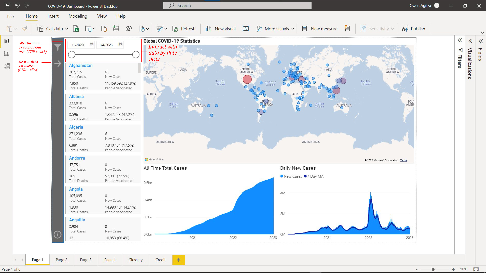

### Table of Contents
- [Description](#description)
- [Problem Statement](#problem-statement)
- [Dataset Information](#dataset-information)
- [Contents](#contents)
- [How To Use](#how-to-use)
- [Author Info](#author-info)

---

## Description
This report provides a real time interactive COVID-19 analytics and insights using real world dataset. The project includes end-to-end data process including ETL, data modelling, data exploration, and data visualization. The tools used to produce this report include DAX, Power BI, Power Query.

---

## Problem Statement
The coronavirus disease 2019 (COVID-19) is rapidly spreading disease that has gained attention around the globe. The author's aim is to develop and deliver useful COVID-19 analytics for public use to combat and report the spread of COVID-19.

In this report, the author wishes to answer these questions which are listed as follows:

1. How's the current COVID-19 global statistics (total cases, new cases, total deaths, and total vaccination) at a glance?
1. How's the performance of countries compared to each other?
1. How's the COVID-19 vaccination distribution amongst countries?
1. What are some of the factors driving full vaccination rate?

---

## Dataset Information
The dataset used in this report is a collection of the COVID-19 data maintained by [Our World in Data](https://ourworldindata.org/coronavirus). It is updated daily and includes data on confirmed cases, deaths, and testing. You can find the complete Our World in Data COVID-19 dataset—together with a complete overview of the sources and more at its [GitHub repository](https://github.com/owid/covid-19-data/tree/master/public/data/). The data you can find here includes:

- **Confirmed Cases and Deaths:** Data comes from the [COVID-19 Data Repository by the Center for Systems Science and Engineering (CSSE) at Johns Hopkins University](https://github.com/CSSEGISandData/COVID-19) (JHU). The methodology for collection of this data is discussed [here](https://ourworldindata.org/coronavirus-source-data). The cases & deaths dataset is updated daily.
  - Note: confirmed cases and deaths are collected by Johns Hopkins University by date of report, rathen than date of test/death. Therefore the number they report on a given day does not necessarily represent the actual number on that date, because of the long reporting chain that exists between a new case/death and its inclusion in statistics. This also means that time series can show sudden changes (negative or positive) when a country corrects historical data, because it had previously under- or overestimated the number of cases/deaths.
- **Hospitalizations and Intensive Care Unit (ICU) Admissions:** Data is collected from official sources and collated by Our World in Data. The complete list of country-by-country sources is available [here](https://github.com/owid/covid-19-data/blob/master/public/data/hospitalizations/locations.csv).
- **Testing for COVID-19:** Data is collected by the _Our World in Data_ team from official reports; you can find
further details in the [checklist of questions to understand testing
data](https://ourworldindata.org/coronavirus-testing#our-checklist-for-covid-19-testing-data), information on
[geographical and temporal
coverage](https://ourworldindata.org/coronavirus-testing#which-countries-do-we-have-testing-data-for), and [detailed
country-by-country source information](https://ourworldindata.org/coronavirus-testing#source-information-country-by-country). **On 23 June 2022, new datapoints were stopped being added to the COVID-19 testing dataset.** You can read more [here](https://github.com/owid/covid-19-data/discussions/2667).
- **Vaccinations Against COVID-19:** Data is collected by the _Our World in Data_ team from official reports.
- **Other Variables:** Data is collected from a variety of sources (United Nations, World Bank, Global Burden of Disease, Blavatnik School of Government, etc.). More information is available in [this codebook](https://github.com/owid/covid-19-data/tree/master/public/data/owid-covid-codebook.csv).

---

## Contents
1. **COVID-19 Main Dashboard**

    - Displays the latest COVID-19 statistics by default. The metrics included here are total cases, new cases, total deaths, and vaccination %
    - You can interact with the date slider to show the COVID-19 metrics over time
    - You can filter the data by country and year by (CTRL + click) clicking the filter button inside the panel on the left
    - You can show the metrics per million by (CTRL + click) clicking the right arrow button inside the panel on the left

1. **Country Comparison**

    - Compares the COVID-19 metrics by your selected country and specified date
    - You can view the data by new cases or total cases using the buttons on the upper right corner

1. **Vaccination Statistics**

    - Displays the vaccination statistics of countries and rank them by full vaccination rate
    - You can filter the data by country and year by (CTRL + click) clicking the filter button inside the panel on the left
    - You can interact with the date slider to show the vaccination statistics over time

1. **Vaccination Insights**

    - Displays the correlation of GDP per capita and full vaccination rate of countries
    - Displays the key influencers of full vaccination rate
    - You can click the blue buttons to drill down on the analysis

1. **Glossary**

    - Lists all the terms used inside the report

---

## How To Use

### Open Locally (recommended)
First, make sure that you have downloaded the latest version of [Power BI](https://www.microsoft.com/en-us/download/details.aspx?id=58494).

To get the report, simply download or clone this repository. From there, you can open it up directly using Power BI for full experience.

Remember to **refresh** the dataset first to get the latest real time data by going to `Home > Refresh`

### Open on the Web
If you are short on time, you can view it in the [web here](https://app.powerbi.com/view?r=eyJrIjoiZmYyNjBlZWItNWI5Ni00OWZkLWE4NjUtMzgwNzgyMjM5ZWI5IiwidCI6ImIzYTkwYTI1LWY2YTUtNDNiYy04YTljLTJhZjNjOWZmNWQ5YiIsImMiOjEwfQ%3D%3D). But, some features like key influencers are disabled for the web. So please open at your own discretion.

---

## Author Info
- LinkedIn - [Owen Agitza](https://www.linkedin.com/in/owenagitza/)

