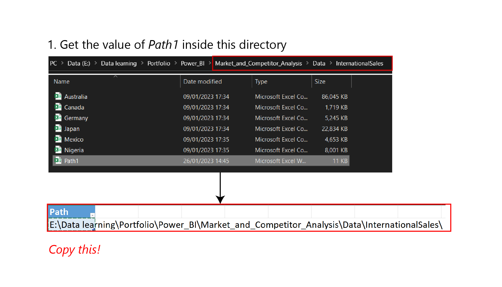

### Table of Contents

- [Description](#description)
- [Problem Statement](#problem-statement)
- [Dataset Information](#dataset-information)
- [Contents](#contents)
- [How To Use](#how-to-use)
- [Author Info](#author-info)

---

## Description
This report lays out a market and competitor analysis using dataset provided by Microsoft. This type of analysis is very common requested by the marketing team or directly from the Chief Marketing Officer (CMO) who is in charge of monitoring the market and competitors.

The project includes end-to-end data process including ETL, data modelling, data exploration, and data visualization. The tools used to produce this report include DAX, Power BI, Power Query.

---

## Problem Statement
The company, VanArsdel, manufactures expensive retail products that could be used for fun as well as work and it sells them directly to consumers nationwide as well as several other countries. 

As a data analyst, the task is to build a a market and competitor analysis report for VanArsdel. The author wishes to answer these questions which are listed as follows:

1. Where does VanArsdel stand in the current market condition compared to the competitors?
1. How does VanArsdel's performance compare against the competitors?
1. Which segments contribute the most to the revenue in a certain time period?
1. How's the international sales distribution of VanArsdel and competitors?

---

## Dataset Information
The dataset used in this report is curated and maintained by [Microsoft](https://powerbi.microsoft.com/en-us/diad/). It is used for training Power BI data analyst with hands-on and real-world projects. You can find the complete dataset [here](https://drive.google.com/drive/folders/15zadnOIOcW7YIVyW_72NXg48ozg-YwrE?usp=share_link). The data you can find here includes:

- **International Sales:** Consists of individual sales data of VanArsdel and competitors for these countries:
    - Australia
    - Canada
    - Germany
    - Japan
    - Mexico
    - Nigeria
- **Theme:** The color palette used inside this report in JSON format
- **US Sales:** Consists of the sales data of VanArsdel and Competitors in the US as well as the list of manufacturers and their products

---

## Contents
1. **Market Analysis**

    - Displays the market landscape and revenue growth over time, including all competitors
    - Displays the product segment trend over time
    - Displays the international sales heatmap
    - You can interact with the date slider to show the market dynamics over time

1. **Competitor Analysis**

    - Compares the performance of other competitors against VanArsdel over time
    - Displays the current revenue progress against last year's revenue as KPI
    - You can interact with the play axis to see how the data evolves over time
    - You can select the manufacturers to compare by selecting (CTRL + click) the button at the top
    - You can drill down quarterly and monthly performance using the drill down button

1. **Glossary**

    - Lists all the terms used inside the report

---

## How To Use

### Open Locally (recommended)
First, make sure that you have downloaded the latest version of [Power BI](https://www.microsoft.com/en-us/download/details.aspx?id=58494).

To get the report, simply download or clone this repository. From there, you can open it up directly using Power BI for full experience.

Should you want to tinker with Power Query inside this report, use the following instructions:

1. Get the value of *Path1*

Open the directory `~\Market_and_Competitor_Analysis\Data\InternationalSales` and open `Path1.xlsx` then copy the value of the whole cell

1. Get the value of *Path2*

Open the directory `~\Market_and_Competitor_Analysis\Data\USSales` and open `Path2.xlsx` then copy the value of the whole cell

1. Enter the value of *Path1* and *Path2* inside their respective parameters

1. Close and apply

### Open on the Web

If you are short on time, you can view it in the [web here](https://app.powerbi.com/view?r=eyJrIjoiMzE1MTgwNGItOTY3Zi00MGRkLWI2ODktMWJiNmNhN2RkNWEzIiwidCI6IjFjNzkxY2Y3LTIwODctNGYyMC1hMGQzLTIwNjEyNGM2ZDllZiIsImMiOjEwfQ%3D%3D).

---

## Author Info

- LinkedIn - [Owen Agitza](https://www.linkedin.com/in/owenagitza/)

